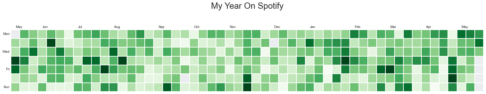

# My Year in Spotify

This was my year 👩🏼‍🎤 ✨. Apparently, every moment was going along with a good song during the second year of the pandemic!

📅 Starting: May 25, 2021

🎶 Record of songs in one day: **400**

> There are two means of refuge from the miseries of life: music and cats.
> 
> Albert Schweitzer

Inspired by the post: [Data viz con spotify - Tacos de datos](https://old.tacosdedatos.com/mas-data-viz-con-spotify-python).

This repo contains:
- Code source: <code>source/sample.ipynb</code>
- Folder data: My spotify data in json format. You can request your data on this [link](https://www.spotify.com/es/account/privacy/). 
For my ease, I put everything together in a CSV file, with the help of the <code>source/main.py</code> script
 
Thank you for reading! 💖 

